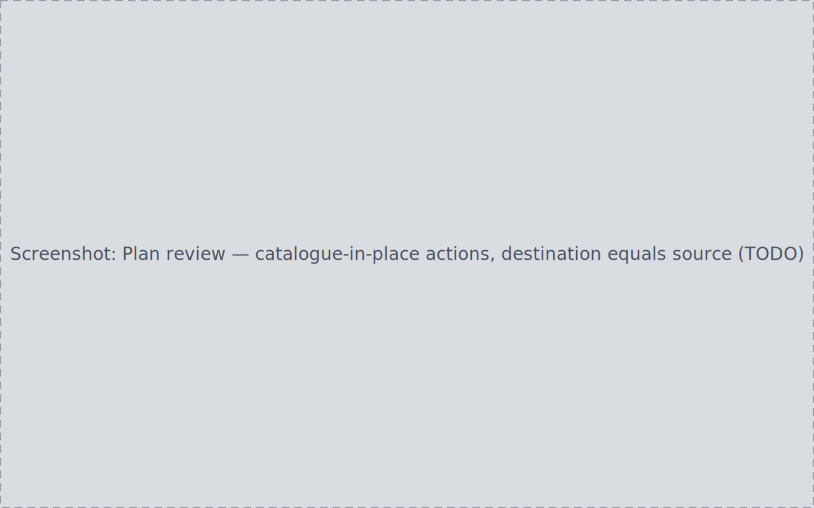

You have years of data in a folder structure you already like — or at least
one you are not ready to change. PlateVault can index it exactly where it
sits: the files become visible in Sessions, projects, and calibration
matching, and the file set and content on disk stay byte-for-byte
unchanged.

The mechanism is the **organized** flag on a library root: files from an
organized root are catalogued in place instead of moved.

## 1. Register the folder as organized

Either:

- in the [setup wizard](../../manual/setup-wizard/)'s Source Folders step
  (also reachable later via **Settings → Advanced → Restart first-run
  setup**), add the folder and set its per-root control to **Organized**;
  or
- in **Settings → Data Sources**, add the folder with the **Add** flow —
  every non-inbox category added there is organized automatically.

## 2. Surface the files into the Inbox

For a non-inbox root, run **Rescan** on that specific root's card in
**Settings → Data Sources** (the Inbox page's own "Rescan all roots" only
reaches inbox-category roots). The root's not-yet-indexed files appear as
Inbox queue items.

## 3. Classify as usual

Items from an organized root go through the exact same
[Inbox](../../manual/inbox/) gate as anything else: mixed folders split
into single-type items, and an item missing mandatory metadata shows the
needs-review banner with Confirm disabled until you resolve it.

## 4. Confirm — and check the plan is all catalogue actions

Click **Confirm**. The response reports a move count of **0** and a
catalogue count equal to the file count, and no destination picker appears
— the files are staying where they are.

Open **Review plans (N)** to verify: every action reads as **catalogue in
place**, with destination equal to source. The Archive-vs-Trash destructive
control is absent, because nothing in the plan is destructive.

## 5. Apply and verify nothing moved

Apply the plan. The catalogue action writes the files' identity and
metadata into PlateVault's index — it performs no filesystem I/O at all.
Afterwards:

- the files appear in [Sessions](../../manual/sessions/);
- the apply is recorded in the Audit Log;
- the on-disk file set and content hashes are identical to before.

If you have both organized roots and an inbox drop folder, the two routes
coexist in the same session: each file routes to catalogue or move purely
by its source root's organization state, never by frame type.
