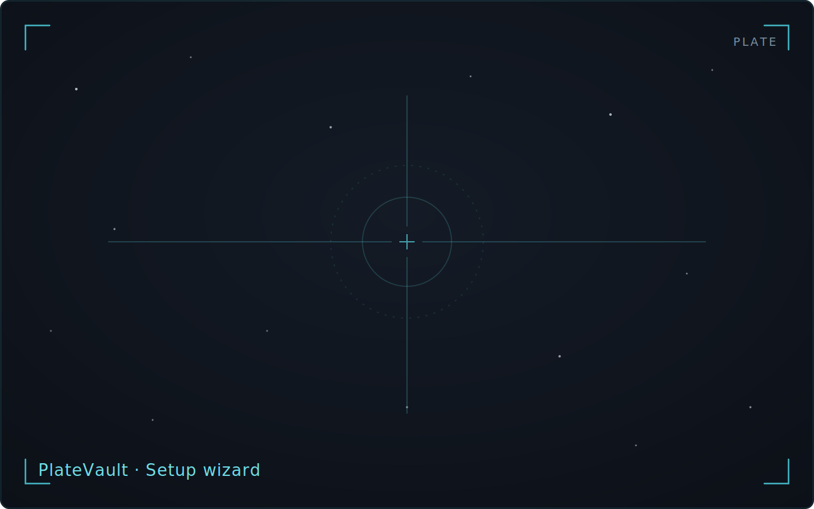
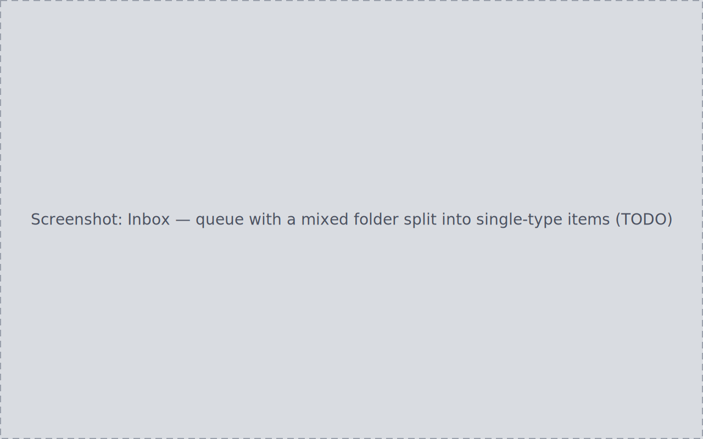
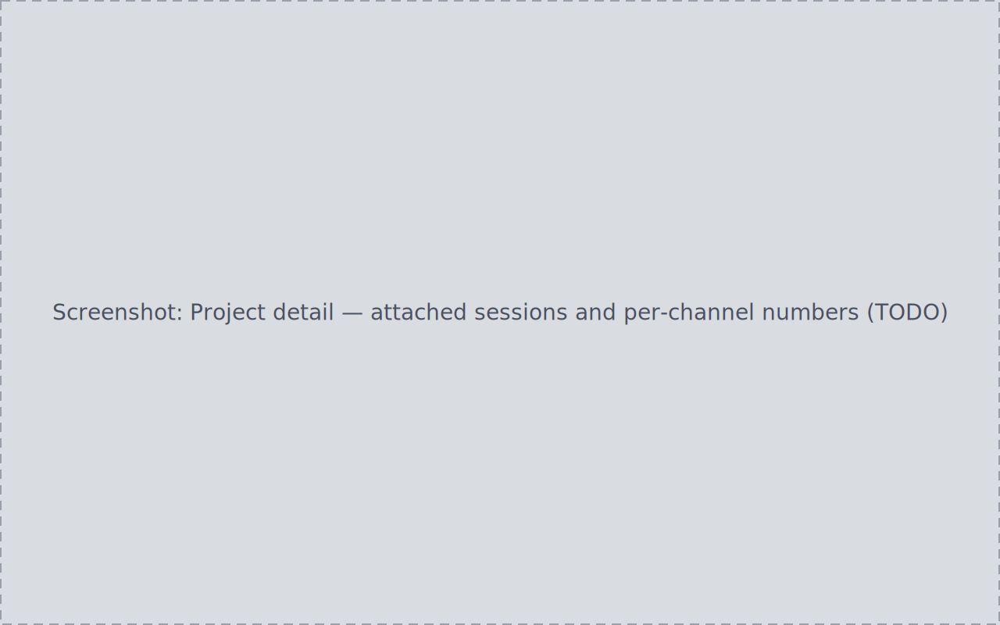
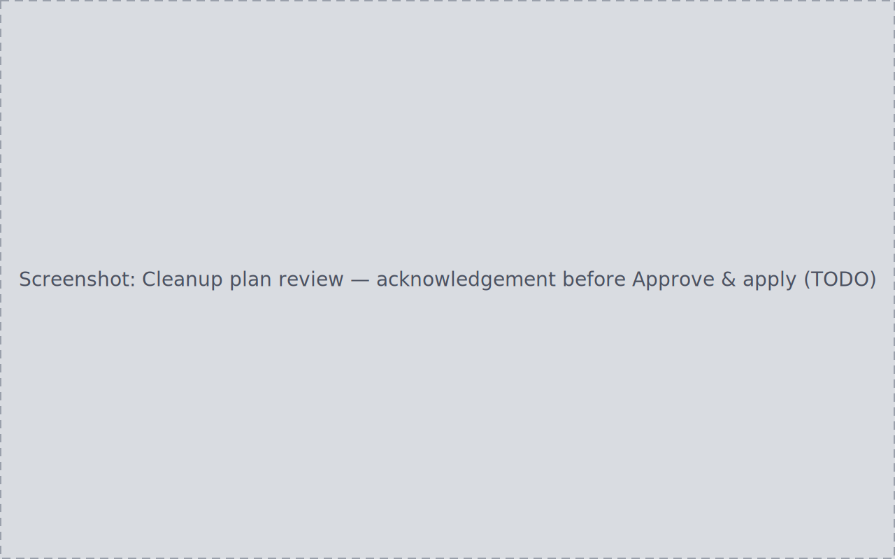

import { LinkButton } from '@astrojs/starlight/components';
import RevealOnScroll from '../../components/RevealOnScroll.astro';

Free and open source (AGPL-3.0) · Windows · Linux · macOS (Apple Silicon)

<RevealOnScroll />

<section class="pv-chapter">
	

		## Starts where your files already are

		Point the [setup wizard](manual/setup-wizard/) at the folders you already
		have — capture output, sorted library, masters, archives. Registration
		records where your data lives and leaves every file exactly as it is.
		And because library roots are tracked separately from the paths beneath
		them, a drive that changes letter or mount point is fixed by
		[remapping one record](how-to/recover-after-moving-a-drive/).
	

	

		
	

</section>

<section class="pv-chapter">
	

		## Every file passes one gate

		New files land in the [Inbox](manual/inbox/), PlateVault's single ingest
		gate. Each item carries a classification you can inspect and correct
		before confirming. Confirming either moves files into your structure
		or catalogues them where they sit. An item missing a mandatory
		attribute is flagged for review until you resolve it.
	

	

		
	

</section>

<section class="pv-chapter">
	

		## Sessions, targets, projects: derived, not entered

		Confirmed files feed the index, and everything else derives from it.
		[Sessions](manual/sessions/) derive automatically — a night's worth of a
		target/filter combination, always current, with the Inbox confirmation
		you already gave as the only gate.
		[Targets](manual/targets-planning/) carry tonight's astronomy computed
		for your observing site: max altitude, visibility, lunar separation.
		[Calibration masters](manual/calibration-masters/) are matched against
		the sessions that need them. [Projects](manual/projects-lifecycle/) collect
		sessions, masters, manifests, and recorded outputs for one processing job.
	

	

		
	

</section>

<section class="pv-chapter">
	

		## Disk changes happen on the record

		When PlateVault does touch disk — an ingest move, a
		[cleanup, an archive](manual/cleanup-archive/) — it first writes a plan:
		every source and destination listed for your review. Only applying the
		plan changes anything, and deletion prefers archive or trash over
		permanent removal. The audit trail logs
		every applied action and every refused or failed one, so what happened
		to your library is always reconstructable.
	

	

		
	

</section>

<section class="pv-chapter pv-chapter--closing">
	

		## Organizes your library. Processes nothing.

		PlateVault never calibrates, stacks, or edits an image. PixInsight/WBPP
		and the tools you already use do the processing; PlateVault does
		everything around it — attaches sessions, matches masters, launches
		the tool against the project folder, and [records the outputs it
		writes back](how-to/prepare-for-pixinsight/).
	

</section>

## Where to start

- Fresh machine: [install PlateVault](how-to/install/), then let the
  [setup wizard](manual/setup-wizard/) register your folders.
- First night of data: [ingest your first session](how-to/ingest-first-session/).
- Years of files already on disk:
  [organize an existing messy library](how-to/organize-existing-library/).
- Ready to process: [prepare inputs for PixInsight/WBPP](how-to/prepare-for-pixinsight/).
- Running out of disk: [plan a cleanup safely](how-to/plan-a-cleanup/).

The Manual pages (starting with the [setup wizard](manual/setup-wizard/)) describe each page of the application;
the How-to guides walk through complete tasks end to end.

	<LinkButton href="https://github.com/platevault/platevault/releases/latest" icon="download">
		Download the latest release
	</LinkButton>
	<LinkButton href="how-to/install/" variant="minimal" icon="right-arrow">
		Install guide
	</LinkButton>

