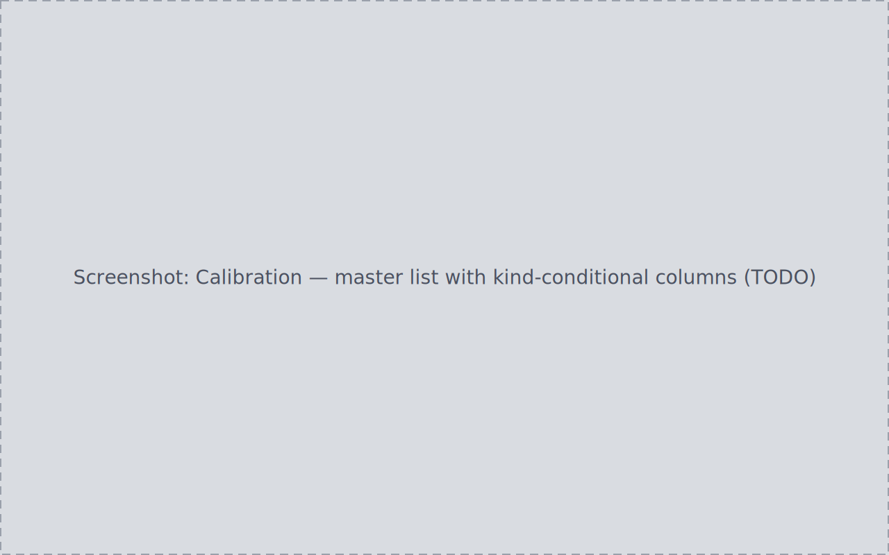
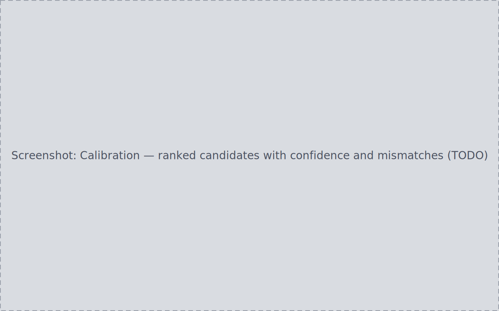

PlateVault tracks calibration master frames — darks, flats, and bias — as
individually identified items and matches them against the acquisition
sessions that need calibration. It never builds a master itself; masters
come from your processing tool and enter the library through the
[Inbox](../inbox/) like everything else.

## Ingesting masters

Point a calibration root at your master files and ingest through the normal
Inbox pipeline. A file classifies as a master when:

- an authoritative stack/combine count in its metadata (Siril `STACKCNT` /
  `NCOMBINE`) is greater than 1, or
- no such count is present, and its filename, path, or `IMAGETYP` carries a
  master naming convention ("master", "_stacked").

A present stack count is decisive and overrides naming: a file named
`dark_master_stacked.fit` whose count is 1 is not a master. Confirming and
applying registers each master into the calibration store as its own item.

## The Calibration page

One row per master file. Fingerprint columns (gain, temperature, binning,
filter) are kind-conditional: a column that does not apply to a kind — a
bias has no meaningful exposure — renders an explicit not-applicable
marker. Missing values render as unresolved and a real zero as `0` with
its source pill — the [Inbox value-rendering rule](../inbox/#per-file-detail).

Sort headers, search, and group-by work as on other list pages, and a kind
filter appears once a second kind exists.

Only dark/flat/bias kinds surface here; master *light* frames,
`dark_flat`, and `bad_pixel_map` are out of scope.

## Master detail

A master's detail panel shows full metadata, provenance, age, history, and
a **Used by** list: the sessions it is assigned to, each navigable. Actions
include **Use in project**, **Replace master**, and the platform-native
reveal control, which opens the master's own folder.

## Matching masters to sessions

Select an unassigned master from a project or from the Calibration page's
matching view. Ranked candidate sessions appear **before** any assignment,
each with its context (target, filter, night, frame count), a confidence
value, and mismatch indicators. A session that fails a hard rule (wrong
gain, for instance) is shown with its mismatch flagged; absent context
renders as unresolved.

Assignment is always explicit.
Confirming records the assignment and updates the Used-by list; the
assignment is also visible from the session and project side. Cancelling
changes nothing.

## Replacing a mis-assigned master

Assign the correct master to the session from the correct master's detail —
forcing past a hard-rule mismatch if you know better than the rule. The
previous assignment for that (session, calibration type) pair is replaced,
not duplicated; both masters' Used-by lists update; the new assignment is
audited. No file is touched — only the assignment link changes.

## Tuning matching tolerances

**Settings → Calibration Matching** exposes the matching rules: toggle a
hard "match required" requirement (camera, binning, gain, offset) or adjust
a soft tolerance (sensor temperature, dark/bias age). Changes persist
durably and still hold after an app restart.
