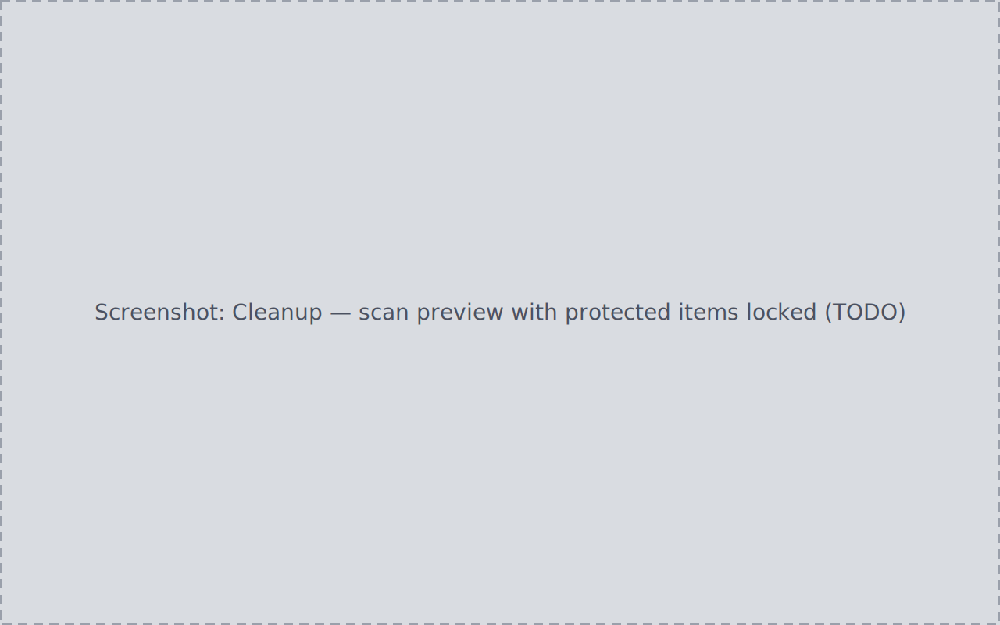

Cleanup plans reclaim disk space from two kinds of superseded data:
processing outputs a project has finished with (intermediates replaced by
masters and finals) and raw sub-frames a session is done with. Both flows
end in the same reviewed, audited plan pipeline as every other change to
disk — scanning proposes, only an applied plan moves anything.

This page covers file-level cleanup. Archiving a *whole project* is part of
the project lifecycle — see
[Projects & lifecycle](../projects-lifecycle/#archiving-a-finished-project).

## Protected files

Every source carries a protection level — the default set in the
[setup wizard's Configuration step](../setup-wizard/#3-configuration)
(protected, unless you change it), overridable per source in Settings →
Data Sources. Protected items surface in cleanup scans as locked entries
with no selection affordance, and a plan can only touch a protected item
after an explicit, per-item, audited acknowledgement at review time.

## Scanning project outputs

From a project's Outputs/Cleanup section, run **Scan for cleanup
candidates**. The result is a read-only preview:

- candidates grouped by kind (Intermediates / Masters / Finals), each with
  size and confidence;
- protected items shown locked;
- a total reclaimable size for the candidate set;
- a clear empty result when there is nothing to reclaim.

Scanning creates no plan and moves no file; scanning twice on an unchanged
project returns the same result.

## Scanning session raw sub-frames

From a session's detail view, run the raw sub-frame cleanup scan. The
preview lists individual light/dark/flat/bias frames with type, size, and
protection state. Non-protected frames are preselected; protected frames
have no selection control; the reclaimable total tracks the current
selection. Adjust the selection before generating — **Generate cleanup
plan** is disabled while nothing is selected.

## Destination: Archive folder or System trash

Before generating, pick where removed files go:

| Destination | Effect |
| --- | --- |
| Archive folder (default) | Files move into an app-managed archive location and remain recoverable |
| System trash | Files move to the OS trash / Recycle Bin |

Permanent deletion is not an option here — cleanup always prefers a
recoverable destination. The destination is fixed at generation time and
shown read-only in the review; changing it means discarding and
regenerating.

## Review and apply

**Generate cleanup plan** creates a plan 1:1 with the candidates in scope
and opens the review overlay:

- every plan item is listed;
- any protected item must be acknowledged individually before **Approve &
  apply** enables;
- **Discard** closes with disk untouched.

Applying shows live per-item progress ("Applying N of M…") and afterward
each item's outcome — succeeded, or failed with a reason. A plan is never
reported fully applied while any item's outcome is unknown, and a failed
item is never silently skipped.

## Confirming the result

After an apply, the moved files are present at the chosen destination, and
a re-run of the scan omits the applied items from the candidate list. Every applied item
and every refusal is recorded in the
[Audit Log](../settings/#audit-log).
