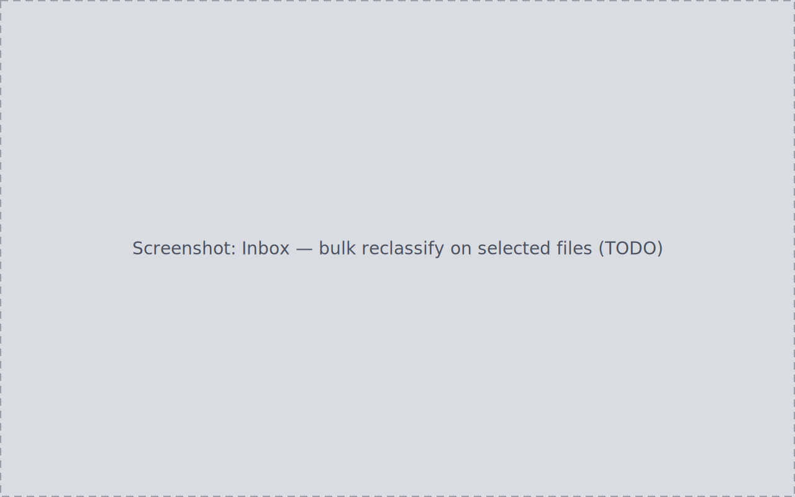
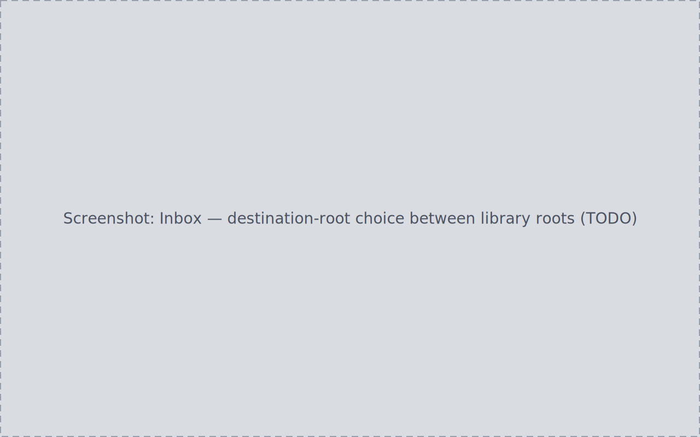
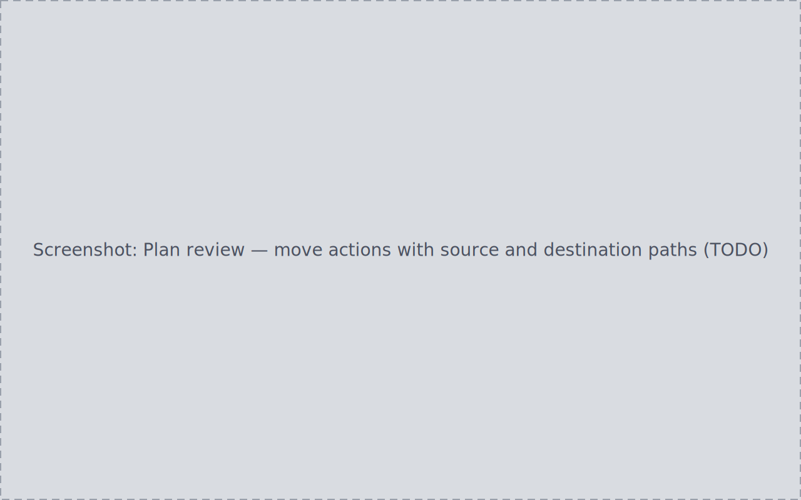

The Inbox is PlateVault's single ingest gate: every file enters the library
through it, whether it will be moved into your library structure or
catalogued where it already sits. Passing the gate requires a
classification you can inspect, and touching disk requires a plan you have
reviewed and applied.

## The queue

**Rescan** picks up new folders under your inbox roots and lists them as
queue items. A folder that mixes frame types (say, lights and darks
together) splits into single-type items (`light · Ha · 300s`,
`dark · 300s`, …), each still visibly grouped back to its shared source
folder. The status-bar breakdown matches the queue's real contents.

## Per-file detail

Select an item to open its detail: frame type, filter, exposure, binning,
gain, temperature, target, and date per file. Every field is one of three
things, visibly distinguished:

- a **real value** with a source pill naming where it came from (FITS
  header, user override, inference, default);
- a **missing-but-applicable value**, shown as an unresolved chip — never a
  bare `0` or blank standing in for missing data;
- a **not-applicable value**, shown as a plain dash with no chip.

The detail keeps tracking the item you selected even while you change search
text or filters.

## Resolving missing metadata

An item missing a mandatory attribute for its frame type (most commonly the
filter for lights, or the target when there is no filter and no coordinates)
is flagged **needs review**: a banner names exactly what is missing,
affected rows carry a "needs *attribute*" badge, and Confirm stays disabled
— the backend independently rejects a confirm attempt on such an item.

To resolve it, select the affected files and set the missing value (frame
type, filter, exposure, or binning) in one bulk action; the applied count is
reported. Once every file has the value, the item re-partitions into a clean
single-type item and Confirm re-enables. Overrides show their provenance (a
source pill distinct from FITS-derived values) and survive later rescans.
Resolving a value only changes PlateVault's index — source file bytes are
never rewritten.

## Choosing a destination

When more than one registered library root can receive an item's frame
type, the item's destination-root control lists them and defaults to
**Auto**. With exactly one valid root, no picker is shown. If Auto cannot
resolve a single root at confirm time, you are prompted to choose.

## Confirm, review, apply

1. **Confirm** turns a fully classified item into a reviewable plan. No file
   moves; the item stays in the queue with a badge showing its open plan.
2. **Review plans (N)** opens the plan review. Every plan item shows its
   action with full source and destination paths. Escape or Discard closes
   without changing anything; a pending destination choice is resolvable here.
3. **Apply** executes the plan. Files move to paths resolved from the
   per-frame-type folder pattern (for example
   `{target}/{filter}/{date}/light/`), and the outcome is reported per item.
   A plan whose source file changed on disk since confirm is refused as
   stale rather than applied anyway; a destination collision is refused
   rather than overwritten.

After an apply, the inbox badge and counters decrement for the moved files,
the new [Sessions](../sessions/) rows appear automatically, and the applied
actions — including any refusals — are in the Audit Log.

## Cataloguing an already-organized folder in place

Files from a root registered as **organized** go through the same
classification and needs-review gate, but Confirm produces a plan made
entirely of **catalogue in place** actions: destination equals source, no
destination picker appears, and applying writes only PlateVault's index —
the on-disk file set and content hashes are byte-for-byte unchanged. In a
mixed run, routing is decided per file by its source root's organization
state, never by frame type. Walkthrough:
[Organize an existing messy library](../../how-to/organize-existing-library/).

## Fixing mistakes before they become permanent

Everything before Apply is reversible without touching disk:

- **Wrong frame type** — change the pending selection before submitting
  (nothing is written until you submit), or resubmit a different value
  after; only the last submitted value counts.
- **Wrong destination** — pick a different root any time before confirming;
  the plan uses whatever was selected at confirm time.
- **Confirmed too early** — discard the confirmed-but-unapplied plan from
  the plan surface. The item reverts to classified and is immediately
  confirmable again, the discard is audited, and no file changes.
- **Plan already open** — reclassifying an item with an open plan is refused
  with a reason naming the plan; discard the plan first.

Discard is refused while a plan is applying or paused — an in-flight plan
cannot be silently abandoned.
