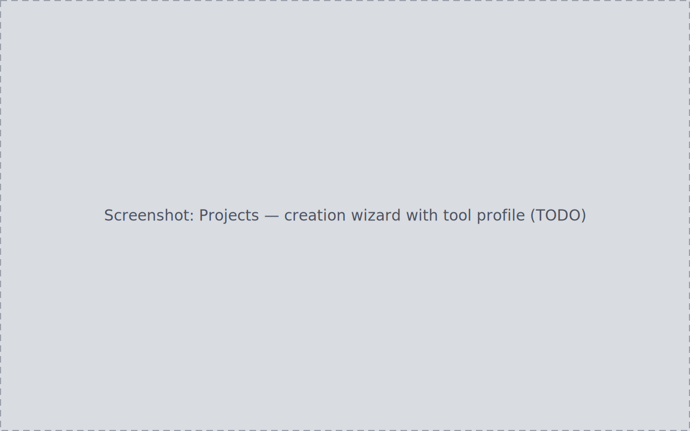
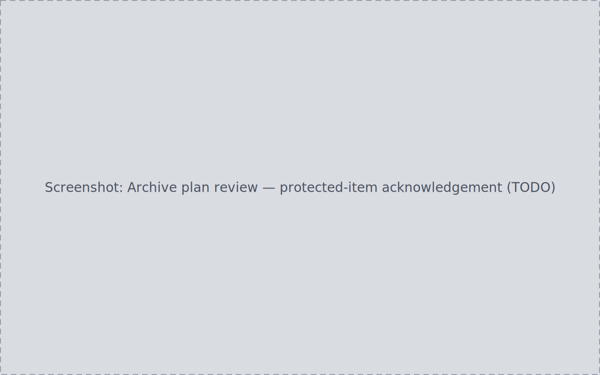
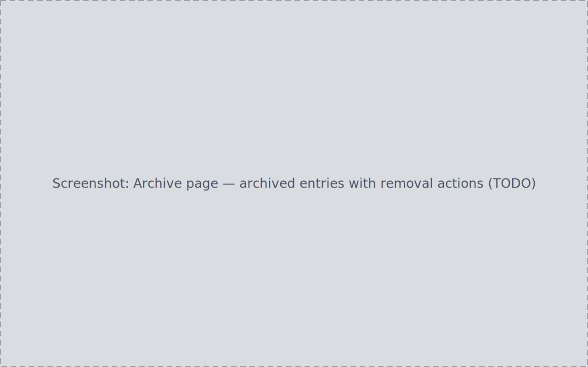

A project turns confirmed acquisition sessions into a tracked unit of
processing work: attached sources, per-channel numbers, manifests, notes, a
launchable processing tool, and automatic tracking of the outputs that tool
writes. When the work is finished, the same project moves through an
audited archive lifecycle.

## Creating a project

Open the creation wizard from the Projects page (or from a target's detail,
see [Targets & planning](../targets-planning/)), enter a name, and
optionally choose a processing-tool profile (PixInsight/WBPP, Siril,
planetary/lunar). On create:

- a toast names the project and its folder outcome;
- the project's folder structure (`lights/`, `darks/`, `flats/`, …) is
  created automatically inside your registered project-outputs root;
- you return to the projects list with the new project present.

A name that collides with an existing project (case-insensitively) is
rejected at the name field on submit — no project and no folders are
created. If a plain file already occupies a folder location, the project
record is still created and you are told which folder could not be created;
the folder-creation step remains in the project's plan for review.

## Attaching sources

From the project's edit view, add sources from a picker that offers only
unlinked, already-confirmed sessions.
Removing a source takes effect immediately, except the last remaining one,
which is intercepted by an inline confirmation. A project in a locked
lifecycle state (archived) refuses source edits with an explicit message.

## Per-channel numbers

The detail view breaks attached data down per channel (per filter): actual
sub-frame counts and total integration time formatted as hours and minutes,
always computed from the sessions attached at that moment. A missing value is
visibly distinct from a real zero.

## Manifests and notes

Every lifecycle-relevant change — creation, a source change, a completed
cleanup or archive — appends a manifest snapshot to an append-only list.
Each manifest has a reveal action
that opens its folder. Notes autosave a few seconds after typing stops,
with a live byte counter against a hard size cap.

## Launching the processing tool

With a tool executable configured, **Open in {tool}** launches it against
the project's working directory without changing the project's lifecycle
state. A working directory that would resolve outside every registered
library root refuses to launch, with a plain explanation; an OS-level spawn
failure is reported. PlateVault prepares inputs and records
outputs — the processing itself happens entirely in your tool (see
[Prepare inputs for PixInsight/WBPP](../../how-to/prepare-for-pixinsight/)).

## Artifact observation

While the project is open, files the tool writes into the project's output
folder are recorded as artifacts with a kind (intermediate / master /
final) and a confidence level. Files written while the project was closed
are picked up on the next open. The watcher observes only the project's own
output folder, and PlateVault never modifies or deletes an artifact file
itself.

## Archiving a finished project

Archiving follows the same plan discipline as every other change:

1. On a **completed** project, choose **Archive**. PlateVault generates an
   archive plan and opens its review in the same interaction.
2. Review the plan: every item shows source and destination (an app-managed,
   collision-free archive folder scoped to this plan). Items from a
   protected source are called out with a stated reason and must each be
   acknowledged before approval; every acknowledgement is audited.
3. Approve and apply. Only after a successful apply does the lifecycle read
   `archived` and the Edit pane become read-only with a stated reason. A
   failed or unapplied plan leaves the lifecycle and editability unchanged,
   and apply never overwrites an existing destination file.

## The Archive page

Archived projects appear on the Archive page as rows with type, reason,
size, and archived date — searchable by name, reason, or original path, and
sortable on every column; missing values render as unresolved, per the
[Inbox value-rendering rule](../inbox/#per-file-detail). Selecting a row shows the project's name, entity type,
original path, and its dated audit history.

Two removal actions follow, in increasing severity:

- **Send to trash** — moves the archived files to the OS trash, where your
  operating system's normal recovery applies. The action is audited.
- **Delete permanently** — removes the archived files from disk with no
  trash recovery. It requires typing the literal word `DELETE` (exact,
  case-sensitive) before the confirm control enables; the backend
  independently rejects a mismatch. When **Block permanent delete** is
  enabled in Cleanup/Protection settings, the deletion is refused
  by the backend and no file is removed. Cancel leaves every file untouched.

Each archived entry also carries the platform-native reveal control ("Show
in File Explorer" on Windows), which opens the archived files' folder.

:::note[Roadmap]
Restore plans — a reviewable plan generated from an archive entry that
moves the archived files back into the library. See the
[Roadmap](../../reference/roadmap/).
:::
