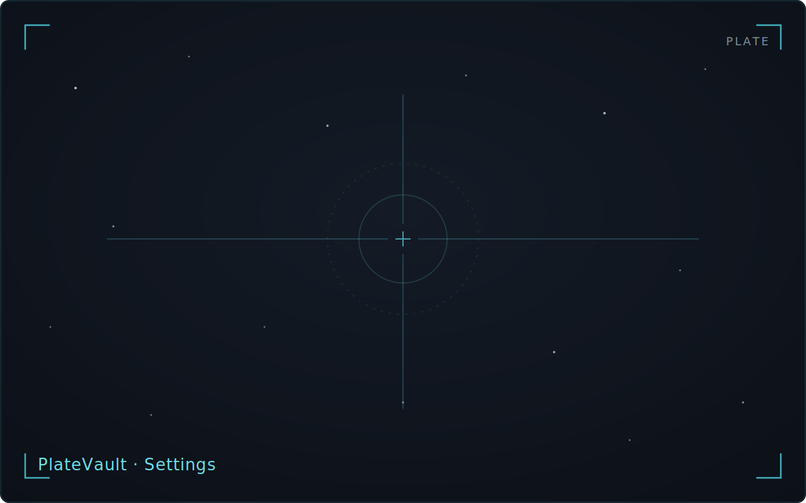
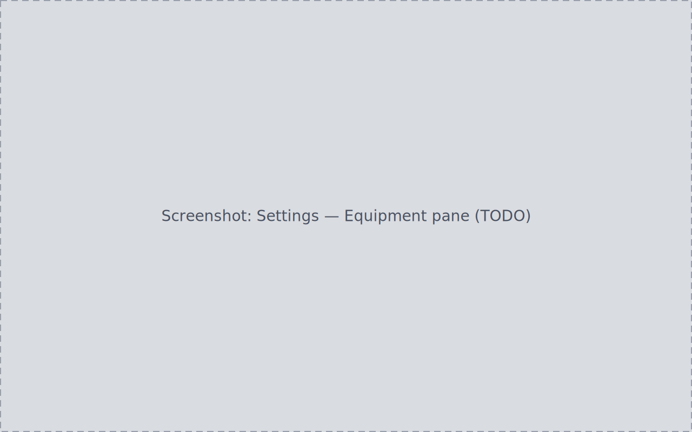
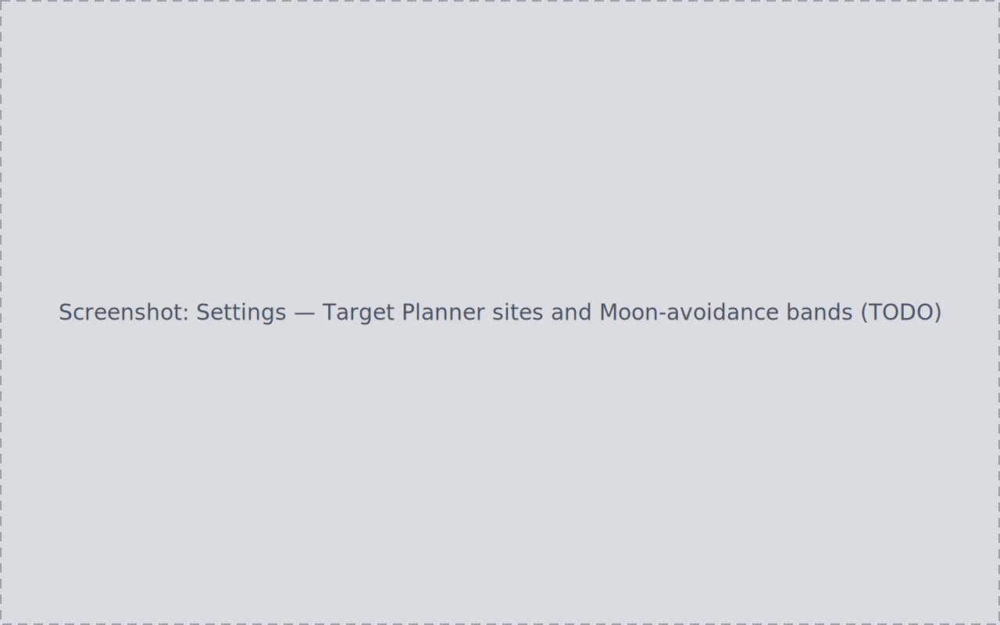
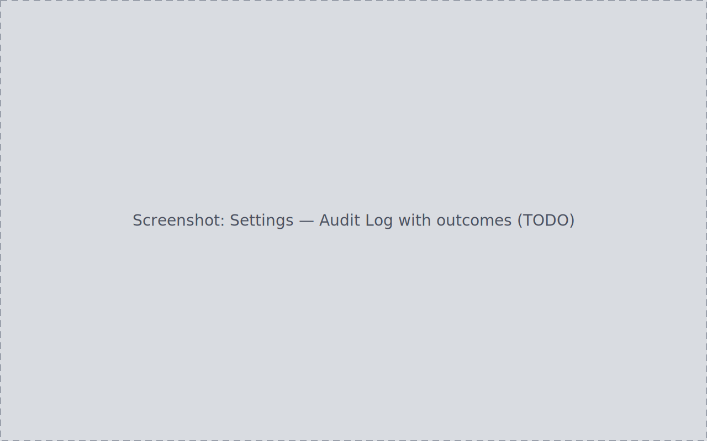

Settings is organized in three sections:

| Section | Panes |
| --- | --- |
| Library | Data Sources, Equipment, Ingestion, Naming & Structure, Target Resolution, Target Planner |
| Processing | Processing Tools, Calibration Matching, Cleanup, Source Views |
| Application | Appearance, Advanced, Audit Log |

Every pane auto-saves — there is no global Save button. A change takes
effect at the control immediately, survives a restart, and (for
durable-data settings) is discoverable afterward in the Audit Log.

## Appearance

- **Theme** — four named themes (Warm Clay, Warm Slate, Observatory,
  Espresso) or **System**, which follows the OS. Themes apply live, with no
  reload and no first-paint flash of the previous theme.
- **Density** — compact / comfortable / spacious, applied to list and table
  row heights across the app.
- **Font size** — applied through the same shared token layer.

## Data Sources and Ingestion

Data Sources holds the per-source lifecycle controls — Rescan, Remap,
Disable/Enable, Delete, protection override, reveal — described in
[Setup wizard & library roots](../setup-wizard/#managing-data-sources-afterward).

Ingestion sets scan behavior defaults: **Follow symbolic links**, **Follow
NTFS junctions**, and the file-hashing mode. Scans do not follow symlinks
or junctions unless you enable it here — a safety default for
libraries spread across drives and link farms. Hashing is optional so large
files are not eagerly read end to end.

## Equipment

Register the gear you own:

- **Cameras** and **Telescopes** — name plus comma-separated aliases
  matching the strings your capture software writes into FITS headers
  (e.g. `INSTRUME`); telescopes also take a focal length in millimeters.
  Manually added entries carry a "Manual" source badge, distinct from
  "Auto-detected".
- **Optical trains** — a name, a focal length, and the registered camera
  and telescope that make up the train; a train requires its parts.
- **Filters** — seeded with Ha, SII, OIII, NII, L, R, G, B, HO, SO, and
  UV/IR Cut; edit, remove, or add entries with a category (narrowband /
  broadband / dual-band / other / custom).

A blank name, a non-numeric focal length, or a duplicate name or alias is
rejected inline before any request is sent. A camera or telescope still
referenced by an optical train cannot be removed — the pane blocks the
attempt with an "in use" message.
Every equipment create, edit, or removal — applied or refused — writes
exactly one audit row; merely viewing the pane writes none.

## Target Planner

- **Observing sites** — add sites with name, latitude, longitude, IANA
  timezone, twilight definition (astronomical/nautical), minimum horizon
  altitude, and optional elevation. Out-of-range coordinates are rejected
  inline. The first site added becomes both **Default** and **Active**;
  with several sites, the Active/Default pills move independently, and
  every planner surface recomputes for the newly active site without a
  restart. Deleting the active or default site asks you to pick a
  replacement when more than one candidate remains; deleting the last site
  returns the planner to its no-site state.
- **Usable-altitude threshold** — 0–90°, default 30°; drives the planner's
  imaging-time and visible-tonight columns.
- **Moon-avoidance bands** — per-band distance/width values for the seven
  fixed bands (L, R, G, B, Ha, SII, OIII), committed on blur/Enter, with a
  Restore Defaults control. The bands are a built-in taxonomy, independent
  of the filters registered under Equipment.

See [Targets & planning](../targets-planning/#tonights-astronomy) for what
these values drive.

## Advanced and danger controls

- **Software Update** — see [Updater](../updater/).
- **Export settings** and **Export database** — via the native save dialog.
- **Restart first-run setup** — confirm-gated; reopens the
  [setup wizard](../setup-wizard/) with your registered folders
  pre-filled.
- **Restart guided flow** — restarts the guided tour; distinct from the
  setup-wizard restart.
- **Reset preferences** — resets UI preferences.
- **Restore defaults** — offered on every pane backed by default values;
  states which settings it resets, then resets them and refetches, so the
  visible fields change.

The Cleanup pane also holds **Block permanent delete**, which makes the
backend refuse every permanent-deletion attempt (see
[Projects & lifecycle](../projects-lifecycle/#the-archive-page)).

## Audit Log

Settings → Audit Log is the durable record of every attempted change
across the library: timestamp, event, entity, outcome (applied /
refused / failed), and actor, with before→after value pairs for settings
changes. It answers "what did PlateVault actually do (or refuse to do)?"
after an unattended scan, a plan apply, or a forgotten background
operation.

The log records committed changes: rapidly typing in the Naming
pattern builder produces one row at the final value, not one per keystroke,
and UI-state-only toggles produce none. Reads never write audit rows.
Automatic background rescans are recorded at diagnostic severity, distinct
from user-initiated actions.

The collapsible bottom **Activity panel** (status-bar Log control) is a
separate, live in-session stream with severity chips
(Error/Warn/Info/Debug), follow mode, entity cross-links, and JSON export —
useful for watching what is happening right now, while the Audit Log is the
durable history.

## Localization and accessibility

Every user-facing string — including backend error codes and audit detail
text — routes through the translation catalog; no raw technical key or
untranslated error surfaces. Sortable tables announce their active sort
column and direction via `aria-sort`, focus states are visible, and every
page keeps its header and action bar pinned while only the content
scrolls, down to a 1100×720 window.
