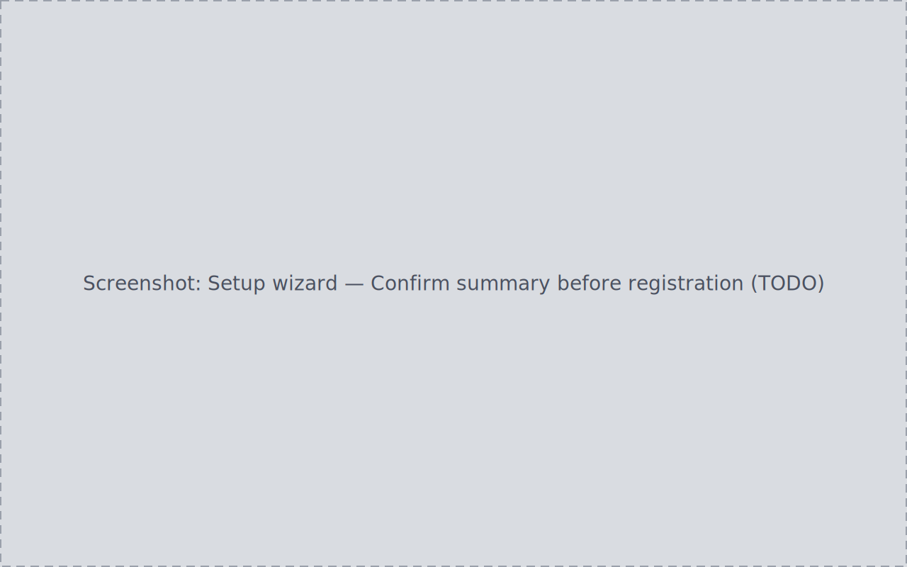
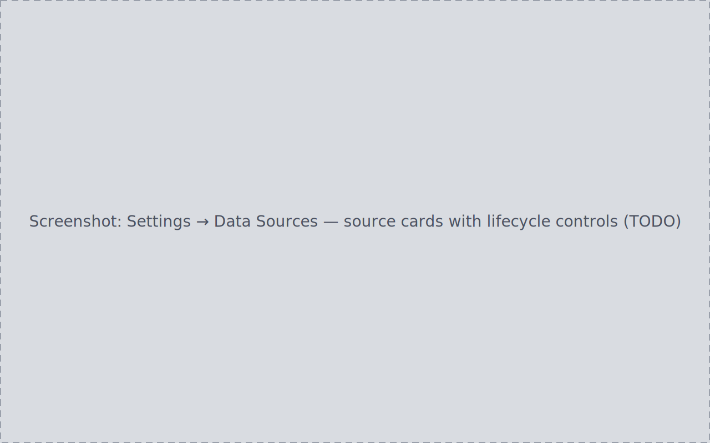

On first launch, PlateVault opens a six-step setup wizard that registers the
folders it should know about. Nothing in the wizard moves, copies, or
rewrites a file — registration only tells PlateVault where your data lives.
You can re-run the wizard at any time from **Settings → Advanced → Restart
first-run setup** (confirm-gated); a restart pre-fills every registered
folder and never deletes any of them.

## The six steps

### 1. Source Folders

Add folders in four categories:

| Category | Required | Organization choice |
| --- | --- | --- |
| Light frames | Yes | Organized or unorganized |
| Calibration | No | Organized or unorganized |
| Project outputs | Yes | Organized or unorganized |
| Inbox | No | Always unorganized |

The wizard blocks progress past this step while Light frames or Project
outputs is empty. Mark a folder **organized** when its structure is already
the way you want it — files from organized roots are catalogued in place
instead of moved (see [Inbox](../inbox/)). An empty path, or a path already
registered under any category, is rejected inline with a distinct reason.

This step is a working buffer: nothing is registered with the backend until
the Confirm step.

### 2. Processing Tools

Point PlateVault at PixInsight/WBPP or another supported tool, or skip. The
choice (or its absence) carries into the Confirm summary and can be changed
later in **Settings → Processing Tools**.

### 3. Configuration

Confirm or adjust basic defaults, including the default protection level
(protected / normal / unprotected) applied to newly registered sources.
Left untouched, new sources register as **protected** — shielded from
cleanup plans until you decide otherwise — except inbox folders, which
register as **normal**, since their whole purpose is to have files moved
out of them.

### 4. Observing Site

Set a site via the map picker or manual entry: name, latitude, longitude,
elevation, and timezone. The step can be left entirely blank. Once name,
latitude, and longitude are all filled, Continue requires latitude in
[-90, 90], longitude in [-180, 180], and a numeric elevation if given. On
Finish the site is saved as both the default and the active observing site;
twilight and horizon settings live in **Settings → Target Planner**.

### 5. Confirm

Review the full summary: every folder with its category and organization
state, plus enabled processing tools and a "what happens next" note. Proceeding registers every source and starts scanning.

If any folder fails to register (missing, not a directory,
unreadable), the wizard shows a batch-failure message and does not advance.

### 6. Scan

Each registered folder scans to a terminal state — including "0 items" for
an empty folder. **Finish** enables only once every scan completes, marks
setup complete, and lands on the [Inbox](../inbox/). The completion flag
persists: relaunching the app never shows setup again.

## Managing data sources afterward

Every registered source appears as a card in **Settings → Data Sources**.
Each lifecycle action below shows its result at the control and writes a durable
audit row (see the [Audit Log](../settings/#audit-log)).

- **Rescan** — re-runs the scan without re-prompting for a path, with an
  explicit started→finished signal and a count delta.
- **Remap** — points the source at a new path after a drive moved. **Verify**
  samples files at the new path with no file movement; **Apply remap** is
  clickable only after a successful Verify and records the old→new path.
  Editing the path invalidates the Verify result until you verify again.
  Full walkthrough: [Recover after moving a drive](../../how-to/recover-after-moving-a-drive/).
- **Disable / Enable** — a disabled source drops out of scan and ingest
  without hiding its prior history. Disabling is confirm-gated; re-enabling
  applies immediately.
- **Delete** — un-registers a source. Offered only while the source is
  offline, confirm-gated, blocked with an explanation while dependent
  sessions or projects exist, and never removes files from disk.
- **Protection override** — set or remove a per-source protection level that
  overrides the default from the Configuration step; both directions are
  audited.
- **Show in File Explorer** (label follows your OS) — opens the OS file
  manager at exactly that folder.
