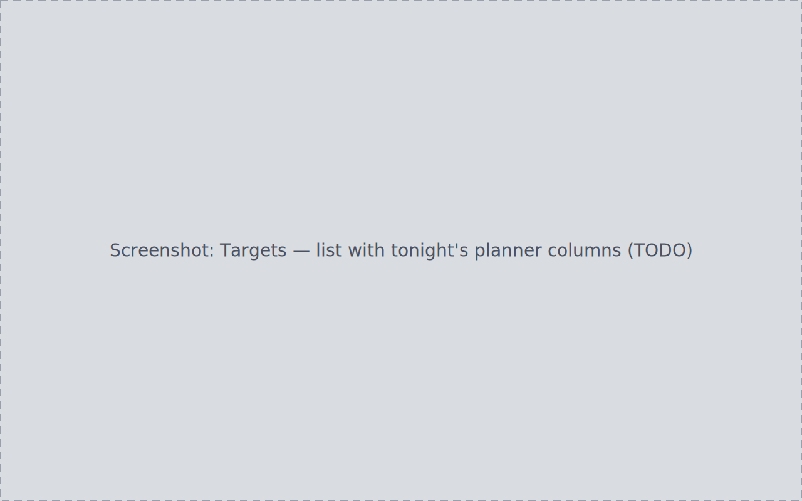
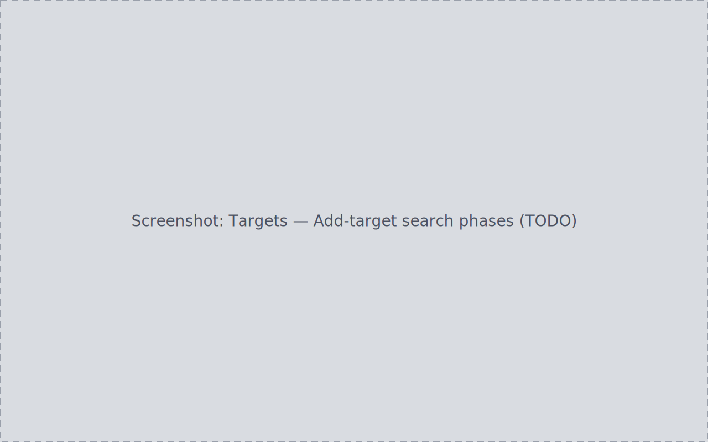
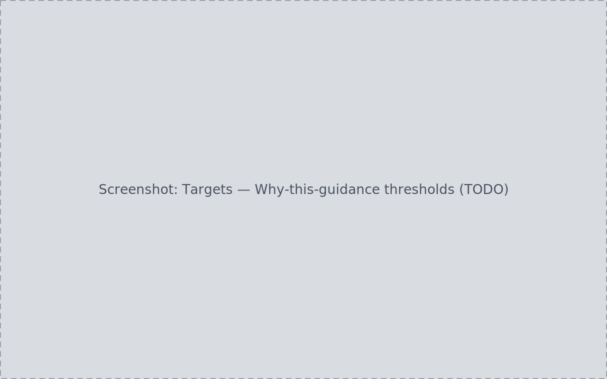

The Targets page is your target library plus a per-site observing
planner: the objects you have decided to track, findable by any of their
names, with tonight's altitude, visibility, and lunar separation computed
for your observing site.

## The target list

The list shows only the targets you have added; the full bundled catalog
is reachable through the Add-target search. Search matches
designations and aliases alike ("M31" and "Andromeda" find the same row).
Columns sort with a single active sort indicator (announced via
`aria-sort`), and the list can be grouped, for example by catalogue.

**My Targets** narrows the list to your starred set. The star toggles from
the row or the detail panel and is stored in the database — it survives an
app restart.

## Adding a target

**Add target** searches in phases, from fastest to widest:

1. **Local typeahead** — the bundled seed index (Messier, Caldwell, and a
   slice of NGC/IC/Sharpless/LBN/LDN) plus your cached lookups, fully
   offline.
2. **SIMBAD lookup** — tried on demand for names outside the seed and
   cache; an unresolved or offline outcome is shown as a plain state, not
   an error.
3. **Search more catalogues** — an explicit action falling back to the
   wider Sesame/NED/VizieR lookup when the first two phases come up empty.
   With zero suggestions on screen, Enter triggers it; with suggestions
   present, Enter selects the highlighted one.

Confirming a match persists exactly one canonical row: re-adding the same
target reuses the existing row, and an unresolvable name adds nothing.
Resolved lookups are cached, so the same name resolves instantly next
time.

## Target identity

A target's detail panel shows its real identity data: designation, type,
coordinates, source, and catalog id. From here you can:

- **Add or remove aliases** — user-added aliases carry a Remove control;
  catalog-provided aliases do not.
- **Set or clear a display label** — the detail heading updates
  immediately.
- **Write observing notes** — saved and persistent across restarts.

## Tonight's astronomy

With an observing site configured in
[Settings → Target Planner](../settings/#target-planner), the planner
columns show per-site, per-night values computed from the target's
coordinates, tonight's date, and your site: Max altitude, Tonight's
sparkline, Visible tonight, Lunar separation, recommended Filters, Image
time, and Opposition. The values change when the site or date changes.

**Why this guidance** opens from the row or the detail panel, names the
per-filter thresholds behind the recommendation, and closes on Escape or an
outside click.

Without a configured site, these columns state that they need one; a
planner number appears only once it has actually been computed.

## Starting a project from a target

A target's detail offers **+ New project here**, which opens the
[project-creation wizard](../projects-lifecycle/#creating-a-project) with
the target carried along — from "I want to shoot this next" to a tracked
project without retyping the target's name.

The link is persistent and bidirectional: the project's Target column and
detail header name the target, the target's detail lists the project under
Projects, and each side navigates to the other pre-selected. The link is
held by id, so renaming the project leaves it attached.
