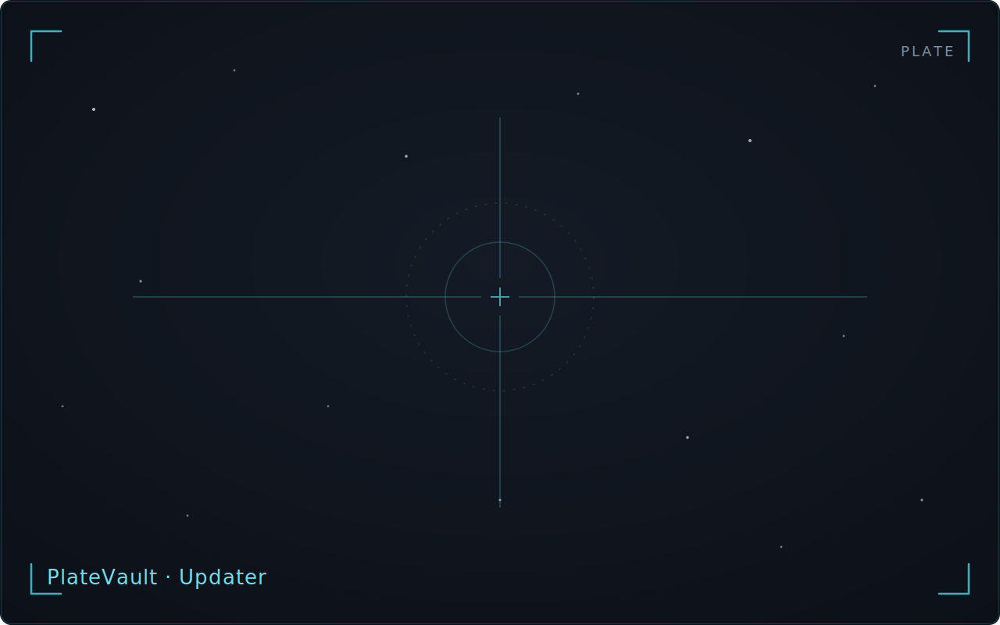

PlateVault checks for updates once, in the background, at application
startup. The check never blocks the interface or repeats during the
session. Its result appears in
**Settings → Advanced → Software Update**, alongside the version you are
running, as one of these states:

- "You're running the latest version."
- "Update available: version {version}"
- a failed check, reported as a failure — never disguised as "up to date"

## Installing an update

**Install & Restart** is a single, explicitly user-initiated action —
nothing is ever downloaded, staged, or installed as a side effect of the
passive startup check. The action:

1. re-runs the update check live;
2. downloads the release artifact from GitHub Releases;
3. verifies the artifact's cryptographic signature against the public key
   embedded in the application;
4. only after verification succeeds, installs the update and relaunches
   into the new version.

An artifact whose signature does not verify is never installed and never
triggers a relaunch — the running version keeps executing unchanged, with
no partial install left on disk.

After a successful install-and-relaunch, Settings → Advanced reads "You're
running the latest version" again, and no prompt reappears for that
release.

## When something fails

Every failure branch — unreachable update feed, failed download, failed
signature verification — is reported inline in the Software Update section
as "Update failed: {message}", carrying the specific underlying error. The
Install action stays available to retry.

No failure branch crashes the app or leaves a partial install: the
version you were running remains fully usable and unchanged, and the next
launch's background check runs normally regardless of the prior failure.

:::note[Roadmap]
A staged update flow — download and verify immediately, restart and
install when you choose. See the [Roadmap](../../reference/roadmap/).
:::
